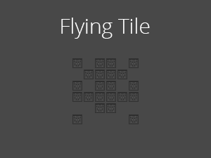

# Flying Tile
A ready-to-be-custom WordPress theme utilizing [Gulp](http://gulpjs.com/), [Stylus](http://learnboost.github.io/stylus/), and [Barekit](http://a2labs.github.io/barekit)

## How to use
Clone or download the zip file to your `wp-themes` folder.

Navigate to the `flying-tile` folder in your cli (or to whatever you renamed the theme folder)

Run `npm install` and then `bower install` to install all the development dependencies

Run `gulp build` to move dependency files that need to exist on the server.

After that you can run `gulp` when you're writing styles. The default task watches and compiles style changes.

## Other notes
There is no need to upload the `node_modules` and `bower_components` folders when you upload your theme to the server.

